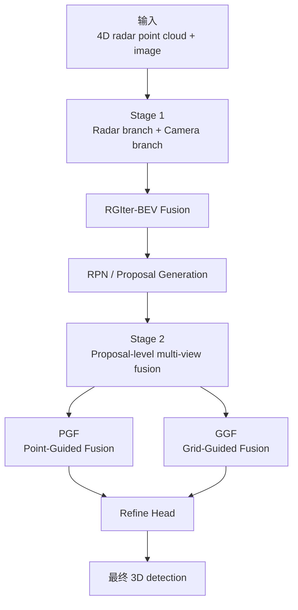
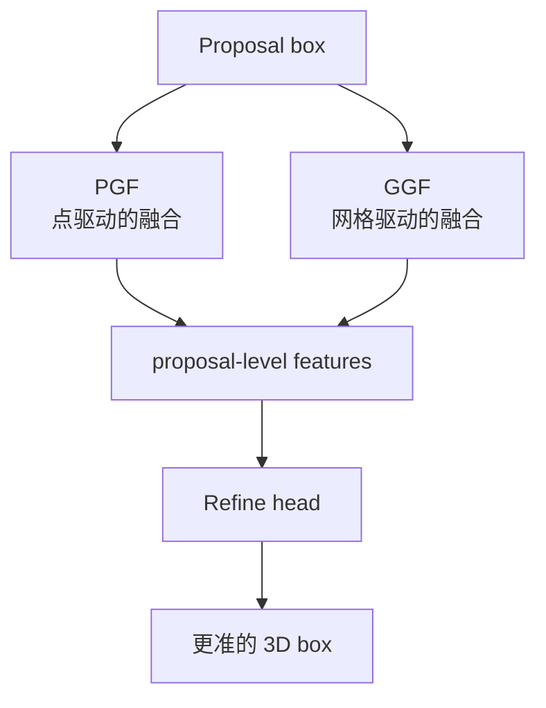
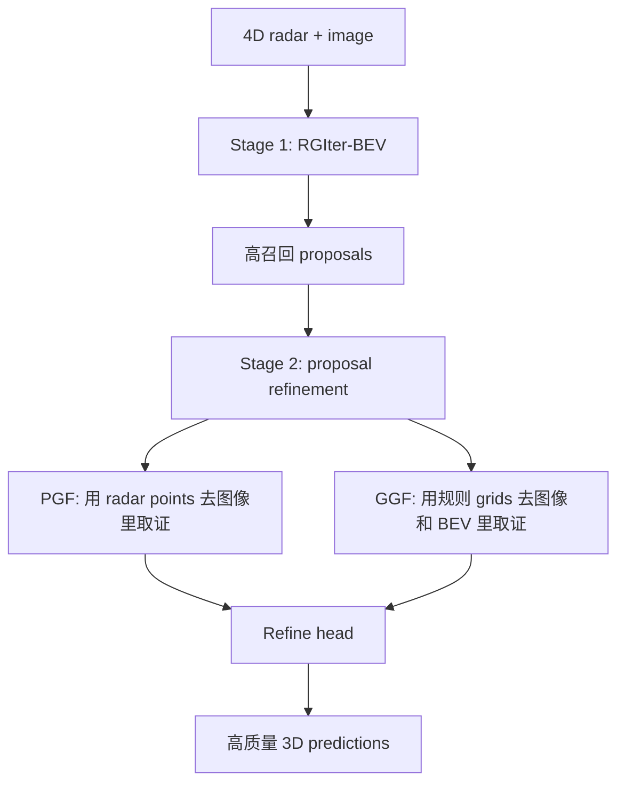

# CVFusion

Paper: **CVFusion: Cross-View Fusion of 4D Radar and Camera for 3D Object Detection**  
Venue: **ICCV 2025**

Official links:

- OpenAccess page: https://openaccess.thecvf.com/content/ICCV2025/html/Zhong_CVFusion_Cross-View_Fusion_of_4D_Radar_and_Camera_for_3D_ICCV_2025_paper.html
- OpenAccess PDF: https://openaccess.thecvf.com/content/ICCV2025/papers/Zhong_CVFusion_Cross-View_Fusion_of_4D_Radar_and_Camera_for_3D_Object_Detection_ICCV_2025_paper.pdf
- ICCV poster page: https://iccv.thecvf.com/virtual/2025/poster/2437
- Code link mentioned in paper: https://github.com/zhzhzhzhzhz/CVFusion

## 0. 一句话先记住

CVFusion 的核心不是“把 radar 和 camera 都扔到一个 BEV 里一次性融合”，而是：

**先用 radar-guided 的 BEV fusion 生成高召回 proposal，再在 proposal 内部做多视角、多模态的 instance-level refinement。**

如果只记一句话，就是：

**第一阶段解决“先把框找出来”，第二阶段解决“把框修准”。**

## 1. Bigger Picture

这篇论文想解决的核心问题是：

- 纯 BEV fusion 虽然简单，但相机转 BEV 会有深度误差。
- radar 本身又稀疏、噪声大，直接和 camera BEV 拼接很容易错位。
- 一阶段方法往往在 proposal 还不够准的时候就直接输出最终框。

CVFusion 的回答是：

1. 先在 BEV 里做一个更稳的、radar 引导的粗检测。
2. 再拿 proposal 去图像视角、点视角、BEV 视角里分别取证据，做第二阶段 refinement。

所以这篇论文最重要的 lesson 是：

**BEV-level fusion 不够，proposal-level multi-view refinement 很关键。**

## 2. 总体架构

整体是一个两阶段框架。

## 3. 从大到小看 pipeline

### 3.1 Stage 1: 先生成高召回 proposals

Stage 1 的目标不是直接给最精确的最终框，而是：

**尽量把目标先找全，生成高召回 proposal boxes。**

这一步包含两条主分支：

- 4D radar branch
- camera branch

#### Radar branch

- 4D radar point cloud 先经过 3D backbone。
- 论文里使用 SECOND 类的 backbone 提取 radar voxel / BEV 特征。
- 多尺度 radar BEV feature 会被拿去引导后续的 iterative fusion。

#### Camera branch

- image 经过 2D backbone 提取前视图特征。
- 再通过 depth-based view transformation 转成 camera BEV feature。

这一步和很多 BEV 方法类似，但作者指出：

**camera FV -> BEV 这个投影本身有深度不确定性，所以 BEV 特征位置可能漂。**

### 3.2 RGIter-BEV Fusion: radar-guided iterative BEV fusion

这是 Stage 1 的核心创新。

#### 它在干什么

作者不用“直接拼 radar BEV 和 camera BEV”，而是让 radar 来引导 camera BEV 的位置增强和逐级 refinement。

直觉上就是：

- radar 虽然稀疏，但位置先验更可靠
- camera 语义更强，但 BEV 对齐不稳定
- 所以用 radar 先告诉 camera：“哪些 BEV 位置更值得信，哪些位置更像有东西”

#### 具体怎么做

在每个尺度上：

1. 从 radar BEV feature 预测一个 occupancy-like weight map。
2. 用这个 weight map 去加权 camera BEV feature。
3. 再把加权后的 camera BEV 逐层下采样、迭代地送到更深尺度做继续融合。

所以这里的“Iterative”不是简单重复，而是：

**从浅层到深层逐步修正 camera BEV 的空间位置表达。**

#### 这个模块解决什么

它主要解决：

- camera BEV 的位置漂移
- radar 和 camera 在 BEV 空间里的错位
- proposal 质量不够高的问题

最终输出：

- 更稳的 fused BEV feature
- 更高召回的 3D proposals

## 4. Stage 2: proposal 内部做多视角 refinement

这是 CVFusion 里最值得学的部分。

作者认为，仅靠全局 BEV 特征还不够，因为 proposal 一旦出来，就应该围绕 proposal 自己去聚合更细的 instance-level evidence。

Stage 2 包含两个互补分支：

- PGF: Point-Guided Fusion
- GGF: Grid-Guided Fusion

## 5. PGF: Point-Guided Fusion

### 5.1 大意

PGF 的想法是：

**proposal 里如果有 radar points，那么这些点就是很强的空间锚点。**

所以它围绕 proposal 内部的 radar points，把 radar point feature 和 image front-view feature 做点级融合。

### 5.2 怎么做

对每个 proposal：

1. 找到 proposal 内部的 radar points。
2. 取出这些点对应的 radar voxel / point features。
3. 把这些 3D radar points 投影到图像上。
4. 用 radar point feature 作为 Query，image feature 作为 Key/Value。
5. 用一个 `CMDA` 模块去做 cross-modality deformable attention。
6. 得到 image-enhanced point feature。
7. 再把这些点特征做 RoI-style 聚合。

### 5.3 CMDA 是什么

CMDA = **Cross-Modality Deformable Attention**

这里不是全局 attention，而是：

- 以 radar point 的投影位置为中心
- 在图像 feature map 上采样少量偏移点
- 对这些采样点做加权聚合

所以 PGF 的本质是：

**用 radar point 作为空间锚，去图像里稀疏取证。**

### 5.4 KDE 在 PGF 里的作用

论文还加了 KDE 风格的点密度信息。

目的很直接：

- 稠密邻域中的点更可信
- 孤立点更可能是噪声或异常点

所以 KDE 其实是在帮助模型区分：

- “结构化的目标相关雷达点”
- “随机的孤立噪声点”

### 5.5 PGF 的优点

PGF 很适合：

- 有雷达点支撑的 proposal
- 需要把 radar 的空间定位能力和图像语义结合起来的场景

但它也有天然弱点：

- 如果 proposal 里几乎没有 radar 点，它就不够稳

这正是 GGF 要补的地方。

## 6. GGF: Grid-Guided Fusion

### 6.1 为什么要有 GGF

作者很清楚一个事实：

**很多 proposal 内可能没有足够 radar points。**

如果只靠 PGF，那么这些 proposal 的 refinement 会很弱。

所以他们设计了 GGF：

**即使 proposal 内没什么点，也能强制从规则网格上提特征。**

### 6.2 怎么做

对每个 proposal：

1. 把 3D proposal box 划分成规则的 `U^3` 个小网格。
2. 对每个 grid center 编码，得到初始 grid feature。
3. 先拿这些 grid centers 去图像 front-view 里做一次 CMDA，得到 FV feature。
4. 再把这个 FV feature 继续作为 query，去 Stage 1 的 fused BEV 上做第二次 CMDA。
5. 最终得到每个网格的联合特征。
6. 再通过 self-attention 和 refine head 聚合成 proposal 特征。

### 6.3 这一步的直觉

GGF 的重点不是“点”，而是“规则覆盖”。

它保证每个 proposal 都有一个规整的内部表示，不依赖 radar 点是否恰好足够。

所以可以把它理解成：

- PGF 是点驱动、稀疏但精细
- GGF 是网格驱动、规则且稳健

## 7. PGF 和 GGF 怎么配合

这两个分支不是重复，而是互补。

### PGF 更擅长

- 利用真实 radar 点作为锚点
- 在点附近做精细跨模态融合
- 对有雷达点支撑的 proposal 更强

### GGF 更擅长

- 在点稀少甚至无点的 proposal 中仍然稳定工作
- 给 proposal 一个完整、规则的内部特征表示
- 从 FV 和 BEV 两种视角做 sequential refinement

所以作者的整体逻辑是：

1. Stage 1 用 RGIter-BEV 把 proposal 先找得比较靠谱。
2. Stage 2 再用 PGF + GGF 把 proposal 修准。

## 8. 这篇论文最值得学的 3 个 idea

### Idea 1: 两阶段比一阶段更适合这类错位严重的融合任务

雷达和相机本来就存在模态差异和对齐误差。  
CVFusion 不试图“一次性融合并直接输出”，而是拆成：

- proposal generation
- proposal refinement

这是非常合理的工程思路。

### Idea 2: 不要只在 BEV 里融合

很多方法只在 BEV 做 fusion。CVFusion 证明：

**proposal 级别把 point、image、BEV 都调进来，能带来更大收益。**

### Idea 3: 稀疏点和规则网格要同时用

只用点不稳，点少时会失败。  
只用规则 grid 又会浪费真实 radar point 的定位优势。

CVFusion 的强点就在于：

**PGF 和 GGF 互补。**

## 9. 如果你只想快速记住它

可以记成下面这张图：

## 10. 你应该从这篇论文带走什么

如果你现在只是想“看 idea，不追代码细节”，那我建议重点带走这几个判断：

- 这篇论文的真正创新不是某一个 attention block，而是 **two-stage cross-view fusion** 这个整体组织方式。
- 它在告诉你：**proposal refinement 在 radar-camera 检测里非常重要。**
- 它说明：**BEV fusion 是起点，不是终点。**
- 它非常适合 VoD / 4D radar 这种“点很稀疏、相机有语义、跨模态错位明显”的场景。

## 11. 论文里可直接引用的结果结论

根据官方 OpenAccess 页面和论文摘要：

- 在 **VoD** 上相对此前 SOTA 提升 **9.10% mAP**
- 在 **TJ4DRadSet** 上提升 **3.68% mAP**

这些结果支持它的核心论点：

**两阶段 cross-view fusion 比只做一阶段 BEV fusion 更强。**

## 12. Sources

- Official ICCV 2025 OpenAccess page: https://openaccess.thecvf.com/content/ICCV2025/html/Zhong_CVFusion_Cross-View_Fusion_of_4D_Radar_and_Camera_for_3D_ICCV_2025_paper.html
- Official ICCV 2025 PDF: https://openaccess.thecvf.com/content/ICCV2025/papers/Zhong_CVFusion_Cross-View_Fusion_of_4D_Radar_and_Camera_for_3D_Object_Detection_ICCV_2025_paper.pdf
- Official ICCV poster page: https://iccv.thecvf.com/virtual/2025/poster/2437
