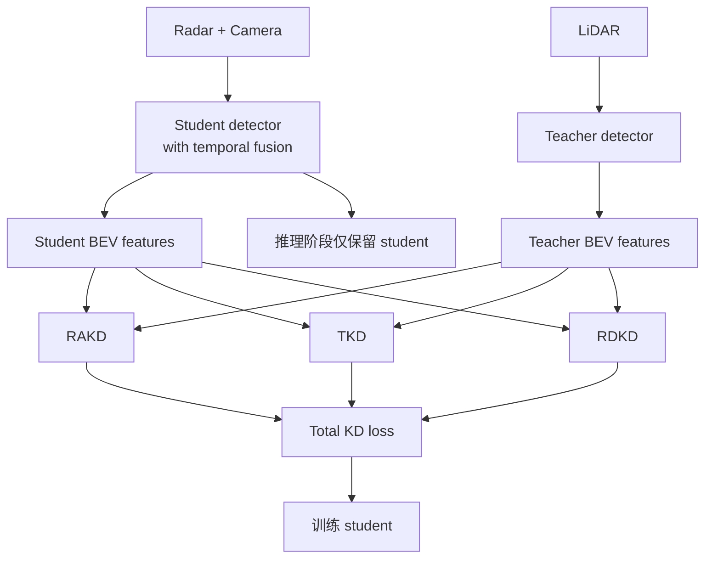
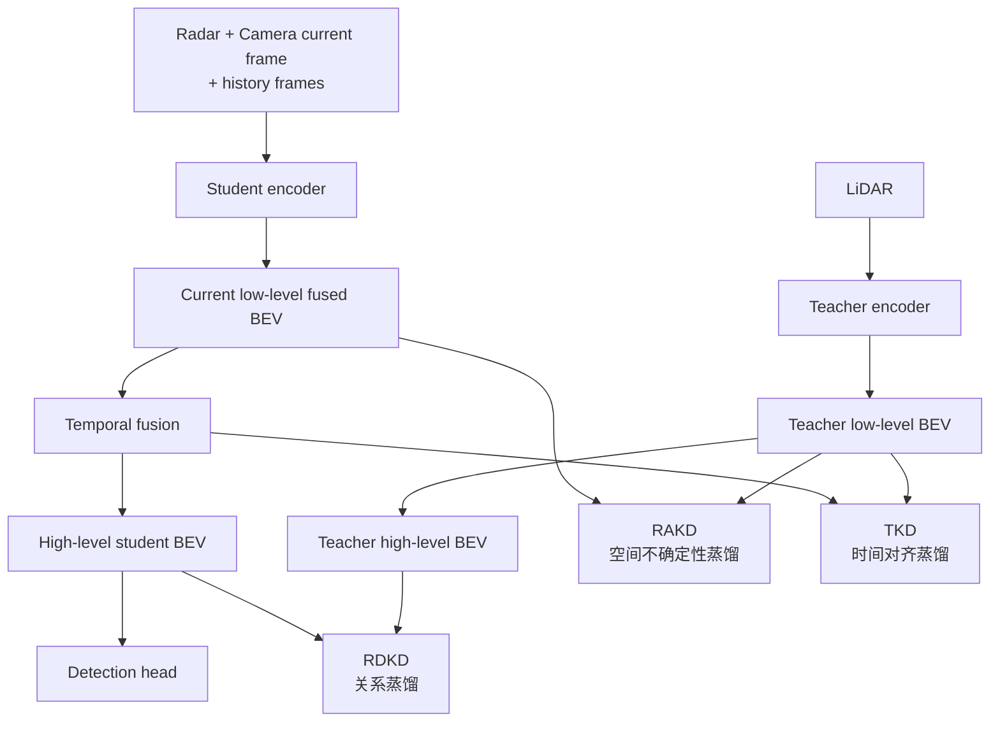
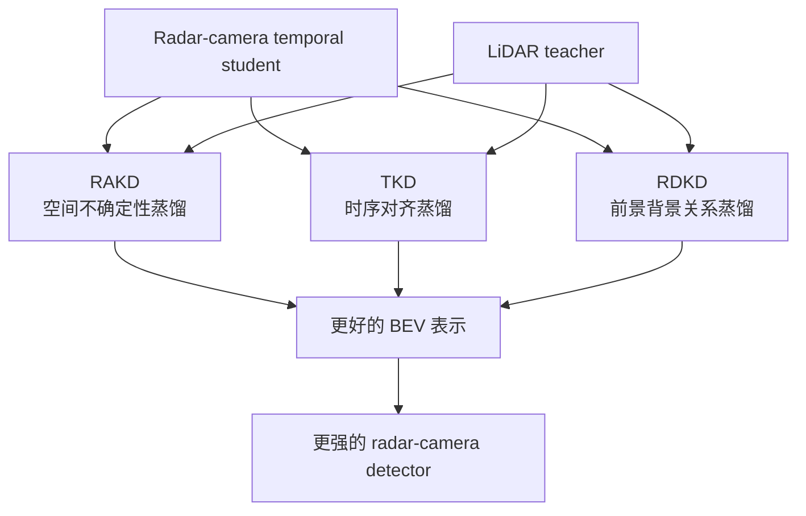

# RCTDistill

Paper: **RCTDistill: Cross-Modal Knowledge Distillation Framework for Radar-Camera 3D Object Detection with Temporal Fusion**  
Venue: **ICCV 2025**

Official links:

- OpenAccess page: https://openaccess.thecvf.com/content/ICCV2025/html/Bang_RCTDistill_Cross-Modal_Knowledge_Distillation_Framework_for_Radar-Camera_3D_Object_Detection_ICCV_2025_paper.html
- OpenAccess PDF: https://www.openaccess.thecvf.com/content/ICCV2025/papers/Bang_RCTDistill_Cross-Modal_Knowledge_Distillation_Framework_for_Radar-Camera_3D_Object_Detection_ICCV_2025_paper.pdf
- ICCV poster page: https://iccv.thecvf.com/virtual/2025/poster/1887

## 0. 一句话先记住

RCTDistill 的核心不是“设计一个全新的 radar-camera detector”，而是：

**在一个带 temporal fusion 的 radar-camera student 上，用 LiDAR teacher 做三种有针对性的 distillation：空间不确定性蒸馏、时间对齐蒸馏、前景背景关系蒸馏。**

如果只记一句话，就是：

**它把 LiDAR 的几何知识，按“空间误差 + 时间误差 + 关系结构”三条路径蒸到 radar-camera 模型里。**

## 1. Bigger Picture

这篇论文的出发点非常明确：

- radar-camera 比 LiDAR 便宜，也更适合部署
- 但精度还是明显落后于 LiDAR
- temporal fusion 和 KD 都能提升性能
- 但以往方法没有认真处理两个关键问题：
  - 传感器本身的不确定性
  - 动态目标导致的时序错位

所以作者不是简单蒸馏 feature，而是问：

**应该蒸什么、在哪蒸、如何考虑 radar-camera 的特殊误差模式？**

他们的答案就是三个模块：

- RAKD
- TKD
- RDKD

## 2. 整体框架

RCTDistill 的训练框架里有两个模型：

- Student: radar-camera detector with temporal fusion
- Teacher: LiDAR detector

但推理时只保留 student。

## 3. Student 和 Teacher 分别是什么

### 3.1 Student

Student 是一个 radar-camera 的时序融合模型。  
从论文和官方 PDF 摘要里可以概括成下面这个流程：

1. radar backbone 提取 radar BEV feature
2. image backbone 提取 camera feature
3. camera feature 通过 VT 变成 camera BEV
4. radar BEV 和 camera BEV 融合成低层 fused BEV
5. 再做 streaming-based temporal fusion，把历史 BEV 一起融合
6. decoder/head 输出 3D detection

可以把 student 理解成：

**一个已经不错的 temporal radar-camera baseline**

作者的重点不是重造 student，而是在这个 baseline 上设计更有效的 distillation。

### 3.2 Teacher

Teacher 是 LiDAR-based detector。  
论文里使用的是 LiDAR teacher，并且训练时冻结 teacher 权重。

所以这篇论文的策略非常明确：

**训练时借 LiDAR 的强几何能力，推理时仍然只用 radar + camera。**

## 4. 整体 pipeline

## 5. 三个模块分别在干什么

## 5.1 RAKD: Range-Azimuth Knowledge Distillation

### 大意

RAKD 针对的是：

**radar-camera 融合 BEV 在空间上本来就不确定，而且这种不确定性不是各向同性的。**

为什么？

- camera 在深度方向更不可靠
- radar 在角度方向更不精确

所以如果你像传统 KD 那样，简单在目标中心周围画一个圆形区域做蒸馏，其实不够合理。

### 核心 idea

RAKD 用的是：

**elliptical Gaussian mask**

也就是椭圆形的蒸馏区域，而不是圆形。

这个设计想表达的就是：

- 在 range 方向和 azimuth 方向，不确定性不同
- 蒸馏区域应该顺着这种误差结构来设计

### 它在做什么

对每个目标：

1. 在 BEV 上构造一个椭圆高斯区域
2. 椭圆的长短轴和方向反映 range / azimuth 的误差模式
3. 只在这些更合理的区域里，对 teacher 和 student 的 low-level BEV 做蒸馏

### 你可以怎么理解

RAKD 不是“把 teacher feature 全抄给 student”，而是：

**在 teacher 最有价值、也最符合 radar-camera 误差结构的区域里蒸。**

这是这篇论文很聪明的地方。

## 5.2 TKD: Temporal Knowledge Distillation

### 大意

TKD 针对的是：

**动态目标会让历史帧和当前帧错位。**

如果你直接把历史时刻的 student feature 和 teacher feature 对齐蒸馏，很容易蒸错位置。

### 核心 idea

TKD 先处理时序对齐，再蒸馏。

论文里提到它使用：

- 历史 BEV 特征对齐
- trajectory-aware Gaussian regions
- HA-Net 用来处理历史特征对齐

### 它在做什么

对动态目标：

1. 根据历史 BEV 和运动信息，把历史特征往当前时刻对齐
2. 用轨迹感知的蒸馏区域覆盖物体历史运动轨迹
3. 在这个时间更合理的位置上做 temporal distillation

### 你可以怎么理解

如果 RAKD 解决的是“空间蒸哪儿”，那么 TKD 解决的是：

**时间上应该对齐到哪儿再蒸。**

它的重点不是简单多帧堆叠，而是：

**蒸馏时显式考虑 dynamic object 的时序错位。**

## 5.3 RDKD: Region-Decoupled Knowledge Distillation

### 大意

RDKD 针对的是：

**仅仅把 feature 值蒸过去还不够，student 还需要学会前景和背景之间的关系结构。**

### 核心 idea

它不只蒸单点特征，而是蒸：

**feature relationship**

也就是通过 affinity / relation map，让 student 学会：

- 哪些区域像前景
- 哪些区域像背景
- 前景和背景之间应该如何被区分

### 它在做什么

1. 从 teacher 的高层特征里构建 relational knowledge
2. 让 student 去匹配这种前景-背景关系结构
3. 增强 student 的判别能力

### 你可以怎么理解

如果说：

- RAKD 是空间级蒸馏
- TKD 是时序级蒸馏

那么：

**RDKD 是语义关系级蒸馏。**

## 6. 这三者怎么配合

这篇论文最值得记住的一点，就是三个模块不是重复，而是分工很清楚。

### RAKD 负责

- 处理传感器特有的空间误差
- 在合理的椭圆区域蒸 low-level BEV

### TKD 负责

- 处理动态目标导致的时序错位
- 在时间对齐后蒸 temporal BEV

### RDKD 负责

- 处理高层判别结构
- 把 foreground/background 关系蒸过去

所以它其实是在三条维度上补 student：

1. 空间
2. 时间
3. 关系

## 7. 为什么这篇论文有效

因为它没有把 KD 当成一个统一的、单一的 loss。

作者的思路是：

- radar-camera 的问题不是单一问题
- 不是简单 feature gap
- 而是同时包含：
  - 传感器误差
  - 动态时序错位
  - 前景背景判别不足

所以 KD 也必须分模块设计。

这就是它和很多“teacher-student feature L2 loss”最大的不同。

## 8. 你应该如何理解这篇论文的位置

RCTDistill 更像：

**一个训练策略增强框架**

而不是一个全新的纯 inference-time fusion architecture。

它告诉你的不是“未来 detector 一定长这样”，而是：

**如果允许训练时使用 LiDAR，那么 radar-camera detector 还能被显著拉高。**

所以它特别适合回答这个问题：

**在不增加部署传感器成本的前提下，怎么尽量逼近 LiDAR-level performance？**

## 9. 这篇论文最值得学的 3 个 idea

### Idea 1: distillation region 不应该是统一的圆

RAKD 说明：

**不同模态的误差是有方向性的，KD mask 也应当是方向敏感的。**

### Idea 2: temporal fusion 的蒸馏不能忽略动态目标

TKD 说明：

**多帧不是简单堆历史 feature，动态目标必须显式考虑 temporal misalignment。**

### Idea 3: 高层关系也值得蒸

RDKD 说明：

**teacher 不只是提供更强 feature，还提供更强的 feature relationship。**

## 10. 如果你只想快速记住它

可以记成下面这张图：

## 11. 这篇论文最该带走什么

如果你现在只是想看 idea，而不是深挖公式，我建议记住：

- 这篇论文最核心的不是“teacher-student”四个字，而是 **针对 radar-camera 问题定制 distillation**。
- 它把 KD 拆成了三个很合理的方向：
  - sensor uncertainty
  - temporal misalignment
  - foreground/background relation
- 它非常适合训练阶段能访问 LiDAR、部署阶段不能用 LiDAR 的场景。

## 12. 论文里可直接引用的结果结论

根据官方摘要和官方 PDF 结果页：

- 相对 student 带来约 **+4.7 mAP / +4.9 NDS**
- 在 **nuScenes** 和 **VoD** 上达到 SOTA radar-camera fusion performance
- 推理速度达到 **26.2 FPS**
- 在 VoD 上，论文结果页给出 **62.37 EAA AP / 82.25 RoI AP**

这些结果支撑了它的主张：

**如果 KD 设计得足够“懂 radar-camera 的误差结构”，它确实能显著提升 temporal radar-camera detector。**

## 13. Sources

- Official ICCV 2025 OpenAccess page: https://openaccess.thecvf.com/content/ICCV2025/html/Bang_RCTDistill_Cross-Modal_Knowledge_Distillation_Framework_for_Radar-Camera_3D_Object_Detection_ICCV_2025_paper.html
- Official ICCV 2025 PDF: https://www.openaccess.thecvf.com/content/ICCV2025/papers/Bang_RCTDistill_Cross-Modal_Knowledge_Distillation_Framework_for_Radar-Camera_3D_Object_Detection_ICCV_2025_paper.pdf
- Official ICCV poster page: https://iccv.thecvf.com/virtual/2025/poster/1887
