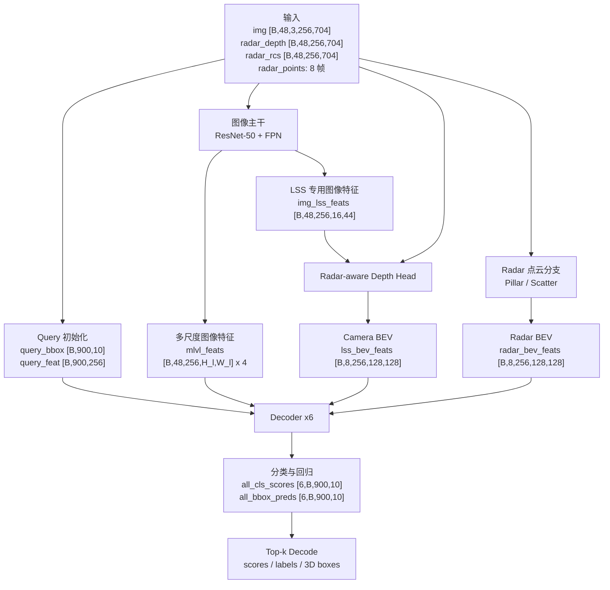
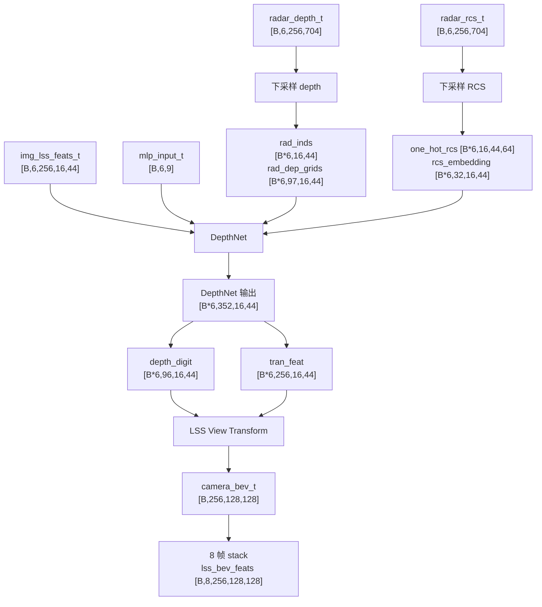
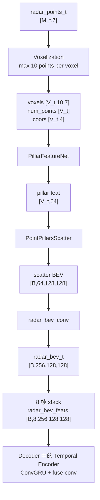
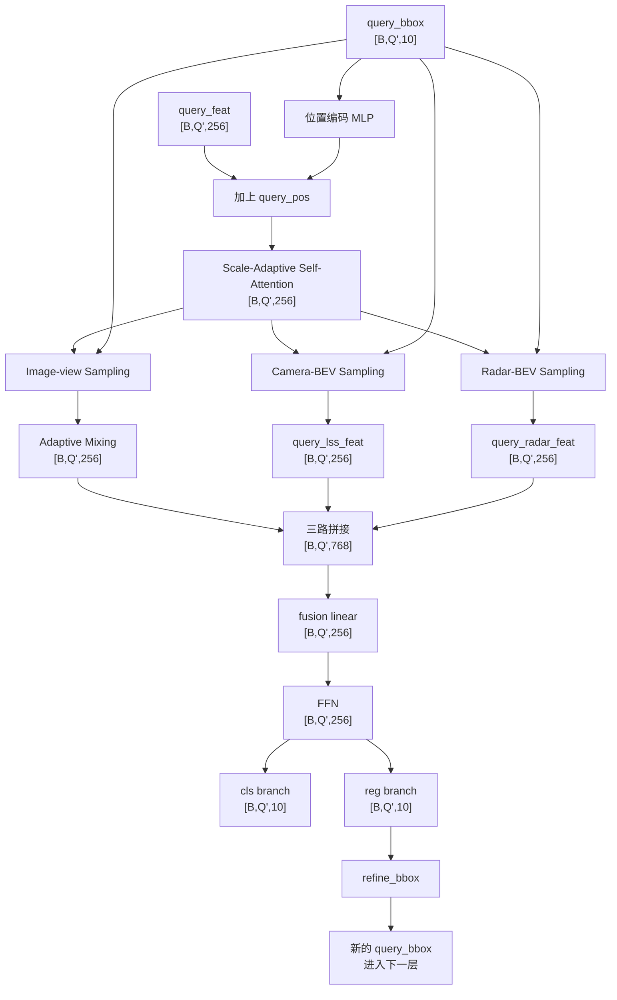
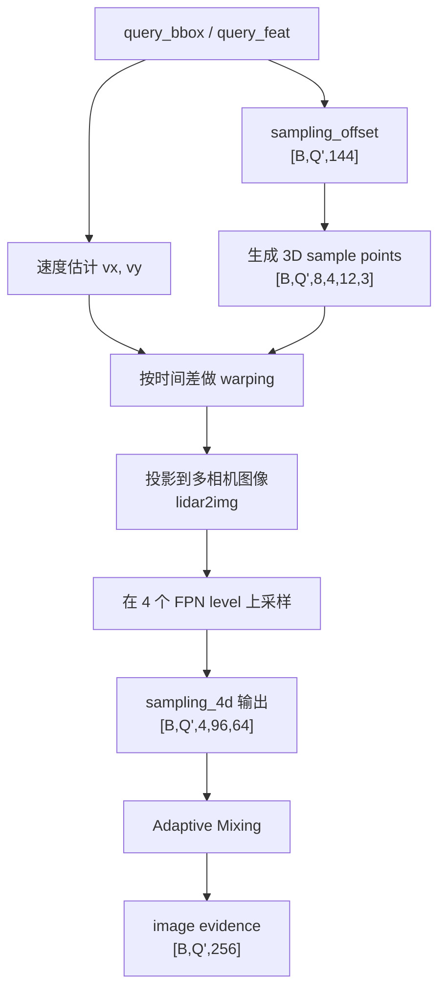
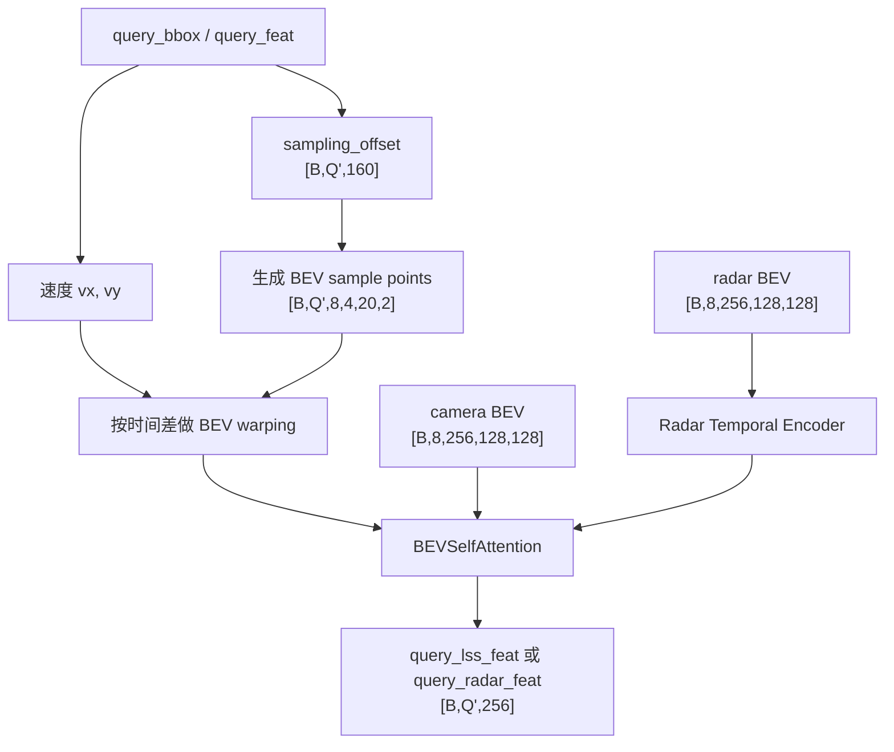

# RaCFormer Notes

These notes summarize the main idea, model pipeline, and tensor shapes of RaCFormer based on the official implementation and the `racformer_r50_nuimg_704x256_f8.py` config.

## 中文版

这一节是上面英文内容的中文整理版，重点放在两件事上：

1. RaCFormer 的核心设计到底是什么。
2. 从输入到输出，每一步张量的 shape 是什么。

### 适用配置

下面的 shape 统一按官方 nuScenes 配置展开：

```text
配置文件: racformer_r50_nuimg_704x256_f8.py
图像分辨率: 256 x 704
相机数: N = 6
时间帧数: T = 8
总图像数: NT = N * T = 48
query 数: Q = 150 * 6 = 900
特征维度: C = 256
深度 bin 数: D_depth = 96
BEV 尺寸: 128 x 128
```

几个最重要的配置常量：

```text
point_cloud_range = [-51.2, -51.2, -5.0, 51.2, 51.2, 3.0]
grid_config['x'] = [-51.2, 51.2, 0.8] -> 128
grid_config['y'] = [-51.2, 51.2, 0.8] -> 128
grid_config['z'] = [-5.0, 3.0, 8.0]   -> 1
grid_config['depth'] = [1.0, 65.0, 96.0]
```

### 核心思想

RaCFormer 的重点不是“先把所有模态都压到同一个 BEV，再做融合”，而是保留三种互补表示，然后让 query 自己去取信息：

1. 图像视角的多尺度特征。
2. 由 radar 辅助深度后得到的 camera BEV 特征。
3. 由 radar pillar 构建出来的 radar BEV 特征。

所以它本质上是一个 query-centric detector。  
每个 query 都像一个候选目标，它会同时：

- 去图像视角采样语义和纹理信息。
- 去 camera BEV 采样空间定位信息。
- 去 radar BEV 采样距离和运动相关信息。

然后在 decoder 里不断 refine 自己的 3D box。

### 符号约定

```text
B: batch size
N: 相机数量 = 6
T: 帧数 = 8
NT: N * T = 48
Q: query 数量 = 900
C: 通道维度 = 256
```

### 1. 输入

模型接收的主要输入是：

```text
img:          [B, 48, 3, 256, 704]
radar_depth:  [B, 48, 256, 704]
radar_rcs:    [B, 48, 256, 704]
radar_points: 长度为 T=8 的 list
              每一帧里，每个样本是一组 [M_t, 7] 的 radar points
```

这里要注意：

- `radar_depth` 和 `radar_rcs` 不是原始雷达图，而是 dataloader 先把 radar points 投到图像平面上生成的。
- radar point 的 7 维在实现里大致可以看成：

```text
[x, y, z, rcs, vx_comp, vy_comp, time]
```

- 代码里会把 radar 的 `z` 强行设成 `0`，说明实现上明确不太相信 radar 的高度。

### 2. 图像主干和 FPN

先把图像 flatten：

```text
[B, 48, 3, 256, 704] -> [B*48, 3, 256, 704]
```

ResNet-50 输出四层：

```text
C2: [B*48,  256, 64, 176]
C3: [B*48,  512, 32,  88]
C4: [B*48, 1024, 16,  44]
C5: [B*48, 2048,  8,  22]
```

FPN 再统一成 256 通道：

```text
P2: [B*48, 256, 64, 176]
P3: [B*48, 256, 32,  88]
P4: [B*48, 256, 16,  44]
P5: [B*48, 256,  8,  22]
```

进入 transformer 前 reshape 成：

```text
mlvl_feats = [
  [B, 48, 256, 64, 176],
  [B, 48, 256, 32,  88],
  [B, 48, 256, 16,  44],
  [B, 48, 256,  8,  22],
]
```

### 3. 给 depth / LSS 用的图像特征

RaCFormer 另外还从 `C4 + C5` 做一个专门给 depth 和 LSS 用的特征：

```text
img_lss_feats: [B*48, 256, 16, 44]
```

切到单帧后：

```text
img_lss_feats_t: [B, 6, 256, 16, 44]
mlp_input_t:     [B, 6, 9]
```

这里的 `9` 来自相机几何相关矩阵拉平后的 `3 x 3`。

### 4. Radar-aware depth head

每个时间步，view transformer 的输入是：

```text
x           = img_lss_feats_t = [B, 6, 256, 16, 44]
radar_depth = per-time map    = [B, 6, 256, 704]
radar_rcs   = per-time map    = [B, 6, 256, 704]
```

先把 radar depth / rcs 下采样到 feature 分辨率：

```text
radar_depth_ds: [B*6, 16, 44]
rad_inds:       [B*6, 16, 44]
one_hot_rcs:    [B*6, 16, 44, 64]
rcs_embedding:  [B*6, 32, 16, 44]
rad_dep_grids:  [B*6, 97, 16, 44]
```

说明：

- `97 = 96 个 depth bin + 1 个空白或无效 bin`
- depth 分支会把图像特征、radar depth bin、RCS embedding 拼起来一起预测深度

在 `DepthNet` 里：

```text
input x:         [B*6, 256, 16, 44]
context branch:  [B*6, 256, 16, 44]
depth branch cat:
  [256 + 97 + 32, 16, 44] = [385, 16, 44]
dep_proj output: [B*6, 256, 16, 44]
depth logits:    [B*6,  96, 16, 44]
```

DepthNet 最终输出：

```text
[B*6, 96 + 256, 16, 44] = [B*6, 352, 16, 44]
```

再切成：

```text
depth_digit: [B*6,  96, 16, 44]
tran_feat:   [B*6, 256, 16, 44]
```

### 5. Camera BEV

通过 LSS view transform，把图像特征 lift 到 3D 再 splat 到 BEV：

```text
camera_bev_t: [B, 256, 128, 128]
```

8 帧 stack 之后：

```text
lss_bev_feats: [B, 8, 256, 128, 128]
```

训练时 depth supervision 用的是第一帧：

```text
depth used for loss: [B*6, 96, 16, 44]
gt_depth:            [B, 6, 256, 704]
```

### 6. Radar BEV 分支

雷达点用 pillar 化，体素尺寸是 `0.8 x 0.8 x 8`，所以整个 BEV 网格是：

```text
128 x 128 x 1
```

每帧流程：

```text
raw radar points: [M_t, 7]
voxels:           [V_t, 10, 7]
num_points:       [V_t]
coors:            [V_t, 4]
pillar feat:      [V_t, 64]
scatter BEV:      [B, 64, 128, 128]
radar conv:       [B, 256, 128, 128]
```

8 帧 stack：

```text
radar_bev_feats: [B, 8, 256, 128, 128]
```

### 7. Query 初始化

Head 初始化：

```text
init_query_bbox: [900, 10]
init_query_feat: [B, 900, 256]
```

一个非常关键的实现细节：

- 内部 query 的前两维不是普通 `(x, y)`
- 而是作者定义的极坐标式 `(theta, d)`

也就是说，query 更像“从中心往外的一条 ray 上的候选目标”。

训练时会额外拼上 denoising queries：

```text
query_bbox: [B, Q', 10]
query_feat: [B, Q', 256]
Q' = 900 + dn_pad_size
```

推理时就是：

```text
query_bbox: [B, 900, 10]
query_feat: [B, 900, 256]
```

### 8. Decoder 内部 shape

decoder 一共 6 层。每层输入：

```text
query_bbox: [B, Q', 10]
query_feat: [B, Q', 256]
lss_bev_feats:   [B, 8, 256, 128, 128]
radar_bev_feats: [B, 8, 256, 128, 128]
mlvl_feats:      4 个 image feature level
```

#### 8.1 Query positional encoding

先把 box 的前 3 维过一个 MLP：

```text
query_pos: [B, Q', 256]
```

再加到 query feature 上：

```text
query_feat = query_feat + query_pos
```

#### 8.2 Self-attention

shape 不变：

```text
input:  [B, Q', 256]
output: [B, Q', 256]
```

这里的 self-attention 不是普通的，它会根据 query 之间的几何距离动态调 attention mask。

#### 8.3 Image-view sampling 分支

配置：

```text
num_groups = 4
num_points = 4
depth_num  = 3
num_frames = 8
num_levels = 4
```

形状：

```text
sampling_offset: [B, Q', 4 * 4 * 3 * 3] = [B, Q', 144]
reshape:
  [B, Q', 4, 12, 3]
frame expand 后:
  [B, Q', 8, 4, 12, 3]
```

再经过按速度做时间 warping、再加深度方向扰动之后：

```text
sampling_points: [B, Q', 8, 4, 12, 3]
scale_weights:   [B, Q', 4, 8, 12, 4]
```

图像采样输出：

```text
sampled_feat: [B, Q', 4, 96, 64]
```

这里：

- `4` 是 groups
- `96 = 8 帧 * 12 个点`
- `64 = 256 / 4`，因为每个 group 只处理 1/4 通道

#### 8.4 Adaptive Mixing

把 image-view 采样结果压回 query 维度：

```text
[B, Q', 4, 96, 64] -> [B, Q', 256]
```

#### 8.5 Camera-BEV sampling 分支

配置：

```text
num_heads  = 4
num_points = 4
depth_num  = 5
num_frames = 8
```

形状：

```text
sampling_offset: [B, Q', 4 * 4 * 5 * 2] = [B, Q', 160]
sampling_points: [B, Q', 8, 4, 20, 2]
scale_weights:   [B, Q', 4, 8, 1, 20]
output:          [B, Q', 256]
```

这里采样的是：

```text
lss_bev_feats: [B, 8, 256, 128, 128]
```

#### 8.6 Radar-BEV sampling 分支

形状和 camera-BEV sampling 基本相同：

```text
input radar_bev_feats: [B, 8, 256, 128, 128]
output query_radar_feat: [B, Q', 256]
```

不过在采样前，雷达 BEV 先过一个时序增强模块：

```text
[B, 8, 256, 128, 128]
-> downsample -> [B, 8,  64,  64,  64]
-> ConvGRU    -> [B, 8,  64,  64,  64]
-> upsample   -> [B, 8,  64, 128, 128]
-> concat     -> [B, 8, 320, 128, 128]
-> fuse conv  -> [B, 8, 256, 128, 128]
```

这就是论文里强调的动态目标建模在代码里的具体实现。

#### 8.7 三路融合和 box refine

三路特征：

```text
image-mixed feat: [B, Q', 256]
radar-BEV feat:   [B, Q', 256]
camera-BEV feat:  [B, Q', 256]
```

融合：

```text
concat -> [B, Q', 768]
linear -> [B, Q', 256]
ffn    -> [B, Q', 256]
```

然后两个 head：

```text
cls_score: [B, Q', 10]
bbox_pred: [B, Q', 10]
```

因为 decoder 有 6 层，所以整体输出：

```text
all_cls_scores: [6, B, Q', 10]
all_bbox_preds: [6, B, Q', 10]
```

如果去掉 denoising 部分，正常检测 query 的输出就是：

```text
[6, B, 900, 10]
```

### 9. 内部 box 表示

decoder 内部存的是：

```text
[theta, d, z, log(w), log(l), log(h), sin(yaw), cos(yaw), vx, vy]
```

之后再转换成最终 head 使用的格式：

```text
[cx, cy, w, l, cz, h, sin, cos, vx, vy]
```

### 10. 最终输出

`NMSFreeCoder` 只解最后一层 decoder 的输出：

```text
all_cls_scores[-1]: [B, 900, 10]
all_bbox_preds[-1]: [B, 900, 10]
```

每个样本：

```text
cls_scores: [900, 10]
bbox_preds: [900, 10]
```

然后：

1. 对类别分数做 sigmoid。
2. 把 `900 x 10` flatten。
3. 取 top-k，最多保留 `300` 个候选。
4. 把 box decode 回真实物理坐标。

最终每个样本输出：

```text
scores: [K]
labels: [K]
bboxes: [K, 9]
K <= 300
```

最终 box 的格式是：

```text
[x, y, z, w, l, h, yaw, vx, vy]
```

### 11. 一句话记住整个张量流

```text
img [B,48,3,256,704]
-> ResNet/FPN
-> mlvl_feats

img_lss_feats [B,48,256,16,44]
+ radar_depth/radar_rcs
-> depth head
-> depth_digit [B*6,96,16,44]
-> camera_bev [B,256,128,128]
-> lss_bev_feats [B,8,256,128,128]

radar_points [8 帧]
-> pillar
-> radar_bev [B,256,128,128]
-> radar_bev_feats [B,8,256,128,128]

query_bbox [B,900,10]
query_feat [B,900,256]
-> decoder x6
-> cls [B,900,10]
-> box [B,900,10]
-> top-k decode
-> final 3D boxes
```

### 12. 读代码时值得注意的细节

#### 12.1 它真的是 query-centric

它不是简单地把 camera BEV 和 radar BEV 拼起来做 dense prediction。  
真正的检测过程是 query 驱动的跨视角、跨模态采样。

#### 12.2 Radar 走了两条路

Radar 在 RaCFormer 里有两条作用路径：

1. `radar_depth + radar_rcs` 帮助相机深度估计。
2. `radar_points -> radar_bev_feats` 直接参与检测和动态建模。

所以它不是“只把 radar 变成 BEV 再融合”那么简单。

#### 12.3 一个值得进一步验证的实现细节

代码里有一个地方我建议之后如果要做严格复现，最好跑一批数据 dump 一下：

- 图像特征切时间是 frame-major 的写法：`img_lss_feats[:, i*6:(i+1)*6]`
- 但 `radar_depth / radar_rcs` 被 reshape 成了 `[B, N, T, H, W]`，再用 `radar_depth[:, :, i]` 取时间

如果 dataloader 展平顺序真的是 frame-major，那么这里相当于默认 `radar_depth` 的内存排列是 camera-major。  
这不影响本文档对整体 pipeline 的理解，但如果之后你要逐行对齐时间索引，这一点值得单独检查。

### 13. 分层流程图

下面这几张图按“先大后小”的顺序组织。

#### 13.1 总览图



#### 13.2 Camera 分支细化图



#### 13.3 Radar 分支细化图



#### 13.4 Decoder 单层细化图



#### 13.5 Decoder 中 image-view sampling 的内部图



#### 13.6 Decoder 中 BEV sampling 的内部图



#### 13.7 从大图到小模块的阅读顺序

建议按下面这个顺序看代码和图：

1. 先看 `13.1`，把总线条记住。
2. 再看 `13.2` 和 `13.3`，分别搞清楚 camera BEV 和 radar BEV 是怎么来的。
3. 然后看 `13.4`，理解 query 在 decoder 每层做了什么。
4. 最后看 `13.5` 和 `13.6`，把 image-view sampling 和 BEV sampling 的细节吃透。

## Scope

The shapes below assume the official nuScenes setting:

- Config: `../literature_review/RaCFormer/configs/racformer_r50_nuimg_704x256_f8.py`
- Image resolution after augmentation: `256 x 704`
- Cameras: `N = 6`
- Frames: `T = 8`
- Queries: `Q = 150 x 6 = 900`
- Embedding dimension: `C = 256`
- BEV grid size: `128 x 128`
- Camera depth bins: `D_depth = 96`

Useful constants from the config:

```text
point_cloud_range = [-51.2, -51.2, -5.0, 51.2, 51.2, 3.0]
grid_config['x']   = [-51.2, 51.2, 0.8] -> 128 cells
grid_config['y']   = [-51.2, 51.2, 0.8] -> 128 cells
grid_config['z']   = [-5.0, 3.0, 8.0]   -> 1 cell
grid_config['depth'] = [1.0, 65.0, 96.0]
```

## Main Idea

RaCFormer does not rely on a single early-fusion BEV representation.

Instead, it keeps three complementary representations and lets object queries sample from all of them:

1. Multi-scale image-view features from the camera backbone/FPN.
2. Camera BEV features produced by radar-assisted depth estimation plus LSS view transformation.
3. Radar BEV features produced from radar pillars, with temporal enhancement for dynamic objects.

The detection query is the fusion center. Each query gathers evidence from image view, camera BEV, and radar BEV, then updates its 3D box hypothesis across decoder layers.

## Symbols

```text
B: batch size
N: number of cameras = 6
T: number of frames = 8
NT: N * T = 48
Q: number of queries = 900
C: embedding dimension = 256
```

## End-to-End Pipeline

### 1. Input

The model receives:

```text
img:          [B, 48, 3, 256, 704]
radar_depth:  [B, 48, 256, 704]
radar_rcs:    [B, 48, 256, 704]
radar_points: list of length T=8
              each element contains per-sample radar points of shape [M_t, 7]
```

`radar_depth` and `radar_rcs` are not raw radar maps. They are generated by projecting radar points to each image and expanding each point vertically across the full image column.

From the dataloader, the 7 radar point channels are taken from:

```text
[x, y, z, rcs, vx_comp, vy_comp, time]
```

where `z` is explicitly set to `0` during loading and also again before radar voxelization.

### 2. Image Backbone and FPN

The image tensor is flattened first:

```text
[B, 48, 3, 256, 704] -> [B*48, 3, 256, 704]
```

ResNet-50 outputs four stages:

```text
C2: [B*48,  256, 64, 176]
C3: [B*48,  512, 32,  88]
C4: [B*48, 1024, 16,  44]
C5: [B*48, 2048,  8,  22]
```

The normal FPN produces four multi-scale feature maps, each with 256 channels:

```text
P2: [B*48, 256, 64, 176]
P3: [B*48, 256, 32,  88]
P4: [B*48, 256, 16,  44]
P5: [B*48, 256,  8,  22]
```

These are reshaped before entering the transformer:

```text
mlvl_feats = [
  [B, 48, 256, 64, 176],
  [B, 48, 256, 32,  88],
  [B, 48, 256, 16,  44],
  [B, 48, 256,  8,  22],
]
```

### 3. Camera Feature for LSS / Depth Head

RaCFormer also builds a separate image feature for depth prediction and view transformation.

`CustomFPN` takes `C4` and `C5` and produces:

```text
img_lss_feats: [B*48, 256, 16, 44]
```

For one frame:

```text
img_lss_feats_t: [B, 6, 256, 16, 44]
mlp_input_t:     [B, 6, 9]
```

The `9` comes from a flattened `3 x 3` matrix built from camera geometry.

### 4. Radar-Aware Depth Head

For one time step, the inputs to the depth-aware view transformer are:

```text
x           = img_lss_feats_t = [B, 6, 256, 16, 44]
radar_depth = per-time map    = [B, 6, 256, 704]
radar_rcs   = per-time map    = [B, 6, 256, 704]
```

Radar depth and RCS are downsampled to the feature resolution:

```text
radar_depth_ds: [B*6, 16, 44]
rad_inds:       [B*6, 16, 44]
one_hot_rcs:    [B*6, 16, 44, 64]
rcs_embedding:  [B*6, 32, 16, 44]
rad_dep_grids:  [B*6, 97, 16, 44]
```

Notes:

- `97 = 96 depth bins + 1 invalid/empty bin`.
- The depth branch concatenates image features, radar depth bins, and RCS embedding.

Inside `DepthNet`:

```text
input x:        [B*6, 256, 16, 44]
context branch: [B*6, 256, 16, 44]
depth branch cat:
  [256 + 97 + 32, 16, 44] = [385, 16, 44]
dep_proj output: [B*6, 256, 16, 44]
depth logits:    [B*6,  96, 16, 44]
```

The final depth net output is:

```text
[B*6, 96 + 256, 16, 44] = [B*6, 352, 16, 44]
```

which is split into:

```text
depth_digit: [B*6,  96, 16, 44]
tran_feat:   [B*6, 256, 16, 44]
```

### 5. Camera BEV via LSS

The view transformer uses the predicted depth distribution and transformed image features to produce a BEV feature:

```text
camera_bev_t: [B, 256, 128, 128]
```

Stacking 8 frames:

```text
lss_bev_feats: [B, 8, 256, 128, 128]
```

The depth supervision used in training comes from the first frame only:

```text
depth used for loss: [B*6, 96, 16, 44]
gt_depth:            [B, 6, 256, 704]
```

### 6. Radar BEV Branch

For each frame, radar points are voxelized with pillar size `0.8 x 0.8 x 8`, so the spatial grid is:

```text
128 x 128 x 1
```

Per frame, the radar pipeline is:

```text
raw radar points: [M_t, 7]
voxels:           [V_t, 10, 7]
num_points:       [V_t]
coors:            [V_t, 4]
pillar feat:      [V_t, 64]
scatter BEV:      [B, 64, 128, 128]
radar conv:       [B, 256, 128, 128]
```

Stacking 8 frames:

```text
radar_bev_feats: [B, 8, 256, 128, 128]
```

### 7. Query Initialization

The head initializes:

```text
init_query_bbox: [900, 10]
init_query_feat: [B, 900, 256]
```

Important detail: the first two coordinates in the internal query box are not standard `(x, y)`.

They are initialized in a polar-like parameterization:

```text
(theta, d)
```

with:

- `150` angular rays
- `6` radial clusters

This is why the method is strongly ray/query based.

During training, denoising queries are prepended:

```text
query_bbox: [B, Q', 10]
query_feat: [B, Q', 256]
Q' = 900 + dn_pad_size
```

During inference:

```text
query_bbox: [B, 900, 10]
query_feat: [B, 900, 256]
```

## Decoder Pipeline

The decoder has 6 layers. The same layer module is reused across iterations.

For each layer, the inputs are:

```text
query_bbox: [B, Q', 10]
query_feat: [B, Q', 256]
lss_bev_feats:   [B, 8, 256, 128, 128]
radar_bev_feats: [B, 8, 256, 128, 128]
mlvl_feats:      four image feature levels
```

### 1. Query Positional Encoding

The first 3 box coordinates are projected by an MLP:

```text
query_pos: [B, Q', 256]
```

Then:

```text
query_feat = query_feat + query_pos
```

### 2. Scale-Adaptive Self-Attention

Self-attention keeps:

```text
input:  [B, Q', 256]
output: [B, Q', 256]
```

It computes pairwise distances between decoded query centers and uses them to modulate attention logits.

### 3. Image-View Sampling Branch

The image branch samples directly from the multi-scale image features.

Config values:

```text
num_groups = 4
num_points = 4
depth_num  = 3
num_frames = 8
num_levels = 4
```

Shapes:

```text
sampling_offset: [B, Q', 4 * 4 * 3 * 3] = [B, Q', 144]
reshape:
  [B, Q', 4, 12, 3]
sampling points before frame expansion:
  [B, Q', 1, 4, 12, 3]
sampling points after frame expansion:
  [B, Q', 8, 4, 12, 3]
```

After time warping by predicted velocity and depth perturbation:

```text
sampling_points: [B, Q', 8, 4, 12, 3]
```

Scale weights:

```text
scale_weights: [B, Q', 4, 8, 12, 4]
```

Image sampling returns:

```text
sampled_feat: [B, Q', 4, 96, 64]
```

Explanation:

- `4` groups
- `96 = 8 frames * 12 sampled points`
- `64 = 256 / 4`, because each group works on one quarter of the channels

### 4. Adaptive Mixing

Adaptive mixing converts:

```text
[B, Q', 4, 96, 64] -> [B, Q', 256]
```

This is the compressed image-view evidence for each query.

### 5. Camera-BEV Sampling Branch

Config values:

```text
num_heads  = 4
num_points = 4
depth_num  = 5
num_frames = 8
```

Shapes:

```text
sampling_offset: [B, Q', 4 * 4 * 5 * 2] = [B, Q', 160]
sampling points:
  [B, Q', 8, 4, 20, 2]
scale_weights:
  [B, Q', 4, 8, 1, 20]
output:
  [B, Q', 256]
```

The branch samples over the 8-frame camera BEV tensor:

```text
lss_bev_feats: [B, 8, 256, 128, 128]
```

### 6. Radar-BEV Sampling Branch

This branch has the same sampling shape as camera-BEV sampling:

```text
input radar_bev_feats: [B, 8, 256, 128, 128]
output query_radar_feat: [B, Q', 256]
```

Before sampling, the radar BEV sequence is enhanced by a temporal encoder:

```text
[B, 8, 256, 128, 128]
-> downsample -> [B, 8,  64,  64,  64]
-> ConvGRU    -> [B, 8,  64,  64,  64]
-> upsample   -> [B, 8,  64, 128, 128]
-> concat     -> [B, 8, 320, 128, 128]
-> fuse conv  -> [B, 8, 256, 128, 128]
```

This is the "implicit dynamic catcher" idea in code form.

### 7. Query Fusion and Refinement

The three branches are fused:

```text
image-mixed feat: [B, Q', 256]
radar-BEV feat:   [B, Q', 256]
camera-BEV feat:  [B, Q', 256]

concat -> [B, Q', 768]
linear -> [B, Q', 256]
ffn    -> [B, Q', 256]
```

The output heads are:

```text
cls_score: [B, Q', 10]
bbox_pred: [B, Q', 10]
```

Because there are 6 decoder iterations:

```text
all_cls_scores: [6, B, Q', 10]
all_bbox_preds: [6, B, Q', 10]
```

If denoising queries are removed, the normal detection part is:

```text
[6, B, 900, 10]
```

## Internal Box Representation

Inside the decoder, the box state is stored as:

```text
[theta, d, z, log(w), log(l), log(h), sin(yaw), cos(yaw), vx, vy]
```

The helper functions convert between:

- polar-like coordinates `(theta, d)` and normalized `(x, y)`
- normalized box space and absolute metric box space

After the head rearranges dimensions, the final normalized prediction format becomes:

```text
[cx, cy, w, l, cz, h, sin, cos, vx, vy]
```

## Final Output

The `NMSFreeCoder` decodes only the last decoder layer:

```text
all_cls_scores[-1]: [B, 900, 10]
all_bbox_preds[-1]: [B, 900, 10]
```

Per sample:

```text
cls_scores: [900, 10]
bbox_preds: [900, 10]
```

Then it:

1. Applies sigmoid to class scores.
2. Flattens `900 x 10`.
3. Takes top-k candidates with `k <= 300`.
4. Decodes boxes into metric space.

Final per-sample outputs:

```text
scores: [K]
labels: [K]
bboxes: [K, 9]
K <= 300
```

The final 3D box layout is:

```text
[x, y, z, w, l, h, yaw, vx, vy]
```

## Compact Tensor Flow

This is the shortest way to remember the whole pipeline:

```text
img [B,48,3,256,704]
-> ResNet/FPN
-> mlvl_feats:
   [B,48,256,64,176]
   [B,48,256,32,88]
   [B,48,256,16,44]
   [B,48,256,8,22]

img_lss_feats [B,48,256,16,44]
+ radar_depth/radar_rcs
-> depth head
-> depth_digit [B*6,96,16,44]
-> camera_bev per frame [B,256,128,128]
-> lss_bev_feats [B,8,256,128,128]

radar_points [T times list of M_t x 7]
-> pillars
-> radar_bev per frame [B,256,128,128]
-> radar_bev_feats [B,8,256,128,128]

queries:
query_bbox [B,900,10]
query_feat [B,900,256]

decoder x6:
  self-attn
  + image-view sampling
  + camera-BEV sampling
  + radar-BEV sampling
  -> cls [B,900,10]
  -> box [B,900,10]

last layer
-> top-k decode
-> final 3D boxes
```

## Implementation Notes

### 1. The design is genuinely query-centric

The core detector does not simply concatenate camera BEV and radar BEV and predict on a dense grid.

Instead, each query:

- samples image-view features directly from projected 3D points,
- samples camera-BEV features,
- samples radar-BEV features,
- fuses them and refines its own 3D hypothesis.

### 2. Radar is used in two different ways

Radar contributes through two separate routes:

1. `radar_depth` and `radar_rcs` help the camera depth head.
2. `radar_points` build radar BEV features for detection and motion modeling.

This split is important. RaCFormer is not just "radar BEV + camera BEV".

### 3. Likely indexing assumption worth checking

One implementation detail looks worth validating with a runtime batch dump:

- image features are sliced in frame-major order with `img_lss_feats[:, i*6:(i+1)*6]`,
- but `radar_depth` and `radar_rcs` are reshaped as `[B, N, T, H, W]` and then indexed with `radar_depth[:, :, i]`.

If the flattened dataloader order is truly frame-major, then this reshape assumes a camera-major memory layout.

This does not invalidate the high-level pipeline summary above, but it is worth checking if the goal is to exactly trace frame-to-frame alignment in the implementation.

## Source Files Used

Main implementation files inspected for these notes:

- `../literature_review/RaCFormer/configs/racformer_r50_nuimg_704x256_f8.py`
- `../literature_review/RaCFormer/models/racformer.py`
- `../literature_review/RaCFormer/models/racformer_head.py`
- `../literature_review/RaCFormer/models/racformer_transformer.py`
- `../literature_review/RaCFormer/models/necks/view_transformer_racformer.py`
- `../literature_review/RaCFormer/models/sparsebev_sampling.py`
- `../literature_review/RaCFormer/models/bbox/utils.py`
- `../literature_review/RaCFormer/models/bbox/coders/nms_free_coder.py`
- `../literature_review/RaCFormer/loaders/pipelines/loading.py`
- `../literature_review/RaCFormer/loaders/nuscenes_dataset.py`
