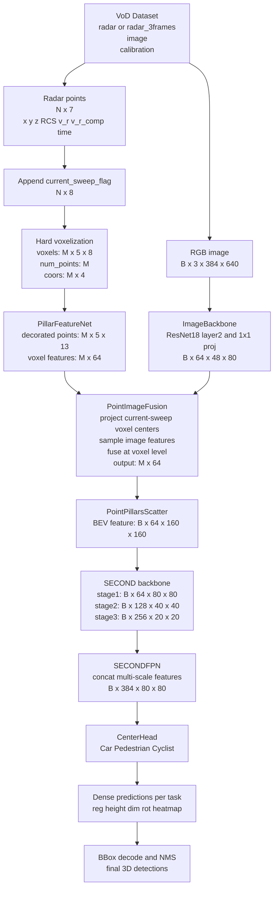
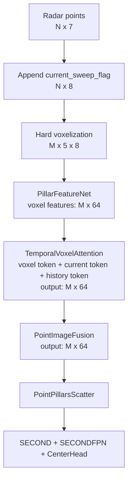

# Model Pipeline

## mar 12 0:00

这是当前已经实现并实际跑通的模型 pipeline。它对应的是：

- radar baseline 的 CenterPoint / PointPillars 主干
- 可选 `1-frame radar + image`
- 可选 `3-frame radar + image`
- `3-frame` 使用 VoD 官方预聚合 radar 数据，不额外在线做 ego-motion compensation
- image 信息是在 **PFN 之后** 做 voxel-level fusion，不是在 raw point 上做 fusion

### current model pipeline



如果 Mermaid 渲染器还是不稳定，可以直接看下面这个纯文本版本：

```text
VoD Dataset
  |- radar / radar_3frames + calibration
  |    -> radar points (N x 7)
  |    -> append current_sweep_flag
  |    -> radar points (N x 8)
  |    -> hard voxelization
  |    -> voxels (M x 5 x 8), num_points (M), coors (M x 4)
  |    -> PillarFeatureNet
  |    -> voxel features (M x 64)
  |
  |- image
       -> RGB image (B x 3 x 384 x 640)
       -> ImageBackbone
       -> image features (B x 64 x 48 x 80)

voxel features + image features + calibration
  -> PointImageFusion
  -> fused voxel features (M x 64)
  -> PointPillarsScatter
  -> BEV feature (B x 64 x 160 x 160)
  -> SECOND backbone
  -> SECONDFPN
  -> CenterHead
  -> dense predictions
  -> bbox decode + NMS
  -> final 3D detections
```

### key implementation details

1. Radar input

- `1-frame` 时，输入来自 `data/view_of_delft/radar`
- `3-frame` 时，输入来自 `data/view_of_delft/radar_3frames`
- `radar_3frames` 是 VoD 官方已经累积好的多帧 radar
- 这些历史 radar 点已经被对齐到当前帧坐标系，所以当前实现里**不再额外做一次 ego-motion compensation**

2. Temporal information

- radar 点的第 7 个通道是 `time`
- 当前代码会从 `time` 中找出最接近 `0` 的点，并生成 `current_sweep_flag`
- 所以进入 voxelization 前的点特征是：

```text
[x, y, z, RCS, v_r, v_r_comp, time, current_flag]
```

3. Voxel / pillar encoder

- `max_num_points = 5`
- 每个非空 pillar 最多保留 5 个点
- PFN 先构造 decorated feature：

```text
raw point features              8
+ cluster center offset         3
+ voxel center offset           2
= decorated point features     13
```

- 然后通过 PFN 得到每个 pillar 的单个 64 维向量：

```text
[M, 5, 13] -> [M, 64]
```

4. Image branch

- 当前 image backbone 是 `ResNet18`
- `feature_level = layer2`
- 输入图像大小固定为 `384 x 640`
- 对应输出 feature map 约为：

```text
[B, 3, 384, 640] -> [B, 64, 48, 80]
```

5. Fusion position

- 当前 fusion **不是** raw point fusion
- 当前 fusion **也不是** attention fusion
- 当前做法是：
  - 先得到 radar voxel feature `[M, 64]`
  - 再把当前 sweep 的 voxel center 投影到 image 上
  - 采样图像特征
  - 通过一个小 MLP 融合回 voxel feature

所以当前实现更准确地说是：

```text
voxel-level image fusion after PFN
```

6. What the current model is not doing

- 没有 temporal attention
- 没有 BEV attention
- 没有 intra-pillar attention
- 没有 explicit motion modeling beyond using the `time` channel and official multi-frame radar input
- 没有 camera-to-BEV lifting
- 没有 YOLO-style image detector branch

### current code locations

- dataset: `src/dataset/view_of_delft.py`
- detector: `src/model/detector/centerpoint.py`
- pillar encoder: `src/model/voxel_encoders/pillar_encoder.py`
- image backbone: `src/model/image_backbones/simple_resnet.py`
- fusion: `src/model/fusion/point_image_fusion.py`
- config: `src/config/model/centerpoint_radar_camera_temporal.yaml`

## next version plan

下一版不直接重写整个 backbone，也不先做全局 BEV attention。先做一个更小但更贴合当前问题的版本：

- 在 `PillarFeatureNet` 之后加入 `TemporalVoxelAttention`
- 输入仍然是当前已经得到的 `voxel_features: [M, 64]`
- 同时读取 `voxels: [M, 5, 8]` 里的 `time` 和 `current_flag`
- 对每个 voxel 构造：
  - `voxel token`
  - `current-sweep token`
  - `history token`
- 用一个轻量 `MultiheadAttention` 做时间建模
- 输出仍然保持 `[M, 64]`
- 然后再进入 image fusion 和后续 BEV backbone

这样做的原因是：

- 比直接改 PFN 更容易接进当前代码
- 比全局 BEV attention 便宜很多
- 它真的利用到了 `3-frame radar` 的时间信息，而不只是“多堆几帧点”
- 对 `1-frame` 也兼容；如果没有历史点，这个模块应当退化成近似 no-op

### next version pipeline



### compared with mar 12 0:00

唯一新增的核心模块是：

```text
PillarFeatureNet -> TemporalVoxelAttention -> PointImageFusion
```

也就是说，当前版和下一版的主要区别不是换 backbone，而是在 scatter 之前先做一层时间感知的 attention refinement。

### attn plus pretrained image variant

在 `next version` 的基础上，还可以直接打开 `torchvision` 的预训练 image backbone：

- 使用 `ResNet18_Weights.DEFAULT`
- 保持当前 temporal attention 不变
- 对 image backbone 的 BatchNorm 进行冻结，减小 batch size 1 时的统计量漂移

对应配置文件：

```text
src/config/model/centerpoint_radar_camera_temporal_attn_pretrained.yaml
```
